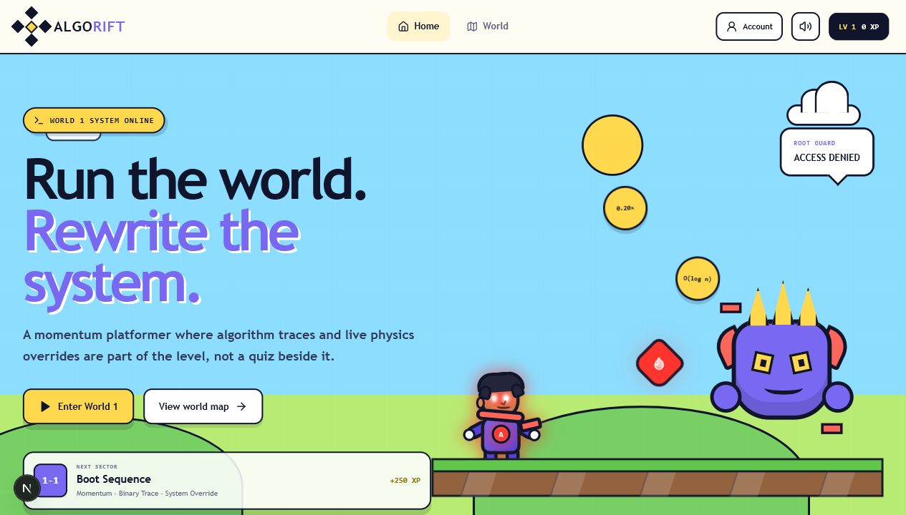

# AlgoRift

**Run the world. Rewrite the system.**

[Play AlgoRift](https://algorift.vercel.app) | [View the source](https://github.com/immanuelgn/AlgoRift)



AlgoRift is an original 2D platformer that makes algorithm reasoning part of
the game world. Players build momentum, discover hidden routes, override live
physics, trace binary-search windows, unlock a piercing power, and fight a
procedural boss. The learning mechanic is embedded in play instead of appearing
as a detached quiz.

## Playable World 1

World 1 contains three distinct side-scrolling sectors:

- **Boot Sequence** introduces momentum, variable jumping, the System Override,
  and the Redline power.
- **Memory Stack** increases gap width, verticality, enemy density, and hidden
  routes.
- **Root Access** combines the learned movement with the final binary trace and
  Root Guard boss.

The binary trace uses the sorted sequence `3, 8, 12, 17, 23, 31, 42`. At each
terminal, the player compares the active pivot with `42` and patches the lower
or higher search window. Correct traces remove firewalls and keep the
platforming flow moving.

## Game Engine

The platformer is a custom HTML5 Canvas engine written in modern TypeScript:

- Fixed-timestep `requestAnimationFrame` loop
- Event-based simultaneous keyboard and touch input
- Acceleration, momentum, ground friction, and air control
- Variable jump height, jump buffering, and coyote time
- Stronger falling gravity for a responsive platformer feel
- Grid-authored levels with AABB tile collision
- Smooth camera tracking with horizontal look-ahead
- Modular `WorldState` and automatic end-flag transitions
- Hidden zones, alternating platform lengths, hazards, enemies, and a boss
- Procedural Canvas artwork and original Web Audio effects

`physicsParams` is a live configuration object. System Override slows the
simulation to 20 percent speed while allowing the player to tune run speed,
jump force, gravity, and friction without rebuilding the engine.

## Controls

| Action | Keyboard | Touch |
| --- | --- | --- |
| Move | `A` / `D` or arrow keys | Direction buttons |
| Variable jump | Hold `Space`, `W`, or `Up` | Hold Jump |
| System Override | `E` or `Shift` | Override button |
| Redline beam | `F` or `J` | Fire button |

## Accounts and Security

Playing as a guest requires no account. Optional Supabase accounts provide:

- Email and password authentication
- A unique public username
- Email confirmation and password recovery
- Cloud-synced XP, campaign progress, and unlocked powers
- Automatic reconciliation between local and cloud saves

Passwords are managed by Supabase Auth and are never stored by AlgoRift. Both
database tables have Row Level Security enabled, and every policy is restricted
to `auth.uid()`. The frontend uses only the browser-safe project URL and
publishable key. Secret keys, service-role keys, and database passwords must
never be placed in `NEXT_PUBLIC_*` variables.

Run [supabase/algorift_setup.sql](supabase/algorift_setup.sql) in the Supabase
SQL Editor to create the tables, trigger, constraints, grants, and RLS policies.
See [SECURITY.md](SECURITY.md) for the deployment checklist.

## Tech Stack

- Next.js 16 App Router
- React 19 and TypeScript
- HTML5 Canvas
- Web Audio API
- Supabase Auth, Postgres, and Row Level Security
- Vercel

## Local Development

```bash
npm install
npm run dev
```

Guest mode works without environment variables. For cloud accounts, create
`.env.local` with:

```bash
NEXT_PUBLIC_SUPABASE_URL=https://YOUR_PROJECT_REF.supabase.co
NEXT_PUBLIC_SUPABASE_PUBLISHABLE_KEY=YOUR_PUBLISHABLE_KEY
```

Then open [http://localhost:3000](http://localhost:3000).

## Quality Checks

```bash
npm run lint
npx tsc --noEmit
npm run build
npm audit
```

## Roadmap

- Sorting race
- Stack and queue tower defense
- Tree traversal climbing world
- Dijkstra shortest-path boss fight
- Greedy interval challenge
- Dynamic programming forge

Designed and developed by
[Immanuel Gnanaseelan](https://github.com/immanuelgn).

## License

Released under the [MIT License](LICENSE).
